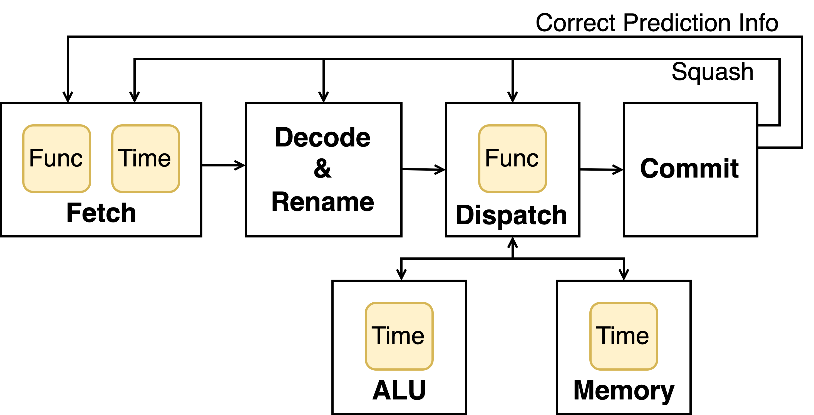

# Pensieve

This repository provides Pensieve, a security evaluation framework for microarchitectural defenses against speculative execution attacks.


## Demo Video Will Come Soon ...

Please check our ISCA 2023 paper, [Pensieve: Microarchitectural Modeling for Security Evaluation](https://people.csail.mit.edu/mengjia/data/Pensieve_ISCA_23.pdf) for a comprehensive understanding of the framework.
Alternatively, its abstract can also provide you with a quick overview:

> Traditional modeling approaches in computer architecture aim to obtain an accurate estimation of performance, area, and energy of a processor design.
> With the advent of speculative execution attacks and their security concerns, these traditional modeling techniques fall short when used for security evaluation of defenses against these attacks.
> 
> This paper presents Pensieve, a security evaluation framework targeting early-stage microarchitectural defenses against speculative execution attacks.
> At the core, it introduces a modeling discipline for systematically studying early-stage defenses.
> This discipline allows us to cover a space of designs that are functionally equivalent while precisely capturing timing variations due to resource contention and microarchitectural optimizations.
> We implement a model checking framework to automatically find vulnerabilities in designs.
> We use Pensieve to evaluate a series of state-of-the-art invisible speculation defense schemes, including Delay-on-Miss, InvisiSpec, and GhostMinion, against a formally defined security property, speculative non-interference.
> Pensieve finds Spectre-like attacks in all those defenses, including a new speculative interference attack variant that breaks GhostMinion, one of the latest defenses.


## Readme Overview

This readme document provides you with the basic usage of this repository.
We will first guide you to [set up the environment](#Environment-Setup) in docker and [run the framework](#Run-Examples) to evaluate a few example designs.

To help you understand the framework, we then [explain the terminal outputs](#Understand-the-Terminal-Output) when evaluating the example designs.
This can guide you through the code that utilizes Rosette for symbolic execution, invokes SMT solver for automatic evaluation, and finally generates attacks on example designs.

Finally, we provide [documents](#Understand-the-Code-and-Verify-Your-Own-Design) on the implementation of our example designs to warm you up for using Pensieve to evaluate your own designs.

## Environment Setup and Running Example
You can create a docker container (and delete it afterwards) with the following commands:
1. Run `git clone https://github.com/CSAIL-Arch-Sec/Pensieve.git` to grab this repository.
2. Run `docker build  - < Dockerfile` to build up the continer.
3. Run `docker run -it --rm -v ${PWD}:${PWD} -w ${PWD} -u root pensieve_env` to log in to the container.
4. Run some pre-set parameters to evaluate example defense designs and find attacks:
    - Spectre attack on Baseline design: `raco test ++arg --param-saved-params ++arg spectre ++arg --param-saved-sizes ++arg spectre src/main_veriSpec.rkt`
    - Interference attack on DoM defense: `raco test ++arg --param-saved-params ++arg DoM ++arg --param-saved-sizes ++arg DoM src/main_veriSpec.rkt`
    - New interference attack variant on GhostMinion defense: `raco test ++arg --param-saved-params ++arg GhostMinion ++arg --param-saved-sizes ++arg GhostMinion src/main_veriSpec.rkt`

Parameters is in `lib/param.rkt`.

Please refer to the Artifact Appendix of the Pensieve paper for more details.


### Physical Machine
To set up a physical machine environment, please refer to [Dockerfile](Dockerfile) to install racket, rosette, boolector, and dask (or HTcondor).


## Understand the Terminal Output

### Workflow

File `src/main_veriSpec.rkt` is the high-level workflow of the code. It will evaluate the design by following steps:

1. Simulate the design using a symbolic initial state with Rosette framework. It prints "Finish Symbolic Execution" to the terminal after this step.
2. Query the SMT solver with security property, which is encoded as a symbolic formula. It prints `Finish STM Solver` after SMT solver finishes.
3. If no counterexample is found, it will print "No Counterexample".
4. If a counterexample is found, it will print "Find Counterexample" and continue to provide the content of the counterexample by following steps:
    1. Query the SMT solver for concrete initial state instances that trigger the counterexample. It includes a pair of initial states with different secret value.
    2. Simulate the design twice under different secrets. During the simulations, it prints out the execution traces specified by `param-debug-print-on` in the code base. It prints out `Finish SMT Result Evaluation` after this step.
    3. Print a summary of the instruction sequence of the counterexample, the initial architecture state, and the final states of the simulation of the ISA model and uarch model.

You can check these steps with `src/main_veriSpec.rkt` and search for `param-debug-print-on` in the code base if you want to customize the printouts.


## Understand the Code and Verify Your Own Design

The code implements a baseline microarchitecture with a few defense augmentations.
We will first give you an [overview of the baseline microarchitecture](#Baseline-Microarchitecture) as well as [how the files are organized](#File-Organization) to implement it.
Then we point you to the source code related to the key technique described in the paper, which [uses uninterpreted functions](#Usage-of-Uninterpreted-Functions) to represent a space of designs.
Finally, we point you to how we augment the baseline microarchitecture to implement our [example defenses](#Defense-Augmentations).
You can further follow the pattern to implement your own defenses and evaluate them.


### Baseline Microarchitecture

We quote part of section 5.1 of the Pensieve paper to give an overview of the baseline microarchitecture.

> 
> 
> **Figure 6: The baseline uarch model with the submodules using uninterpreted functions highlighted.**
> 
> Our baseline uarch model, though simple, covers a large design space and potentially complex pipeline scheduling policies.
> In Figure 6, we highlight the submodules that use uninterpreted functions.
> The fetch module models an arbitrary branch predictor having an arbitrary fetch latency.
> This accounts for different latencies introduced by varied complexity of the branch predictor and varied instruction memory access latency.
> The dispatch module uses an uninterpreted function to select which instruction to send to the corresponding execution unit among the instructions whose operands are ready.
> We use the toy examples from Section 4.1 as the ALU and memory modules, which have been shown to cover a large space.
> 
> We note that our baseline uarch model has concrete decode&rename and commit stages.
> We show our baseline uarch model was sufficient to find vulnerabilities in existing defenses in our case studies and discuss its limitations in Section 8.


Here is a summary of the ISA used:

|      | op   | rs1  | rs2  | rd   |                                 |
| ---- | ---- | ---- | ---- | ---- | ------------------------------- |
| Li   | 0    |      | X    |      | Reg[rd] <- rs1                  |
| Add  | 1    |      |      |      | Reg[rd] <- Reg[rs1] + Reg[rs2]  |
| Mul  | 2    |      |      |      | Reg[rd] <- Reg[rs1] * Reg[rs2]  |
| Ld   | 3    |      | X    |      | Reg[rd] <- Mem[Reg[rs1]]        |
| St   | 4    |      |      | X    | Mem[Reg[rs1]] <- Reg[rs2]       |
| Br   | 5    |      |      | X    | If (Reg[rs2]==0) PC <- PC + rs1 |


### File Organization

We implement the baseline microarchitecture with `src/CPU/CPU.rkt`.

```
main_veriSpec.rkt
|
|-- ISASimulator.rkt
|   |-- sym-state/*
|   |-- inst.rkt
|   |-- decode.rkt
|
|-- CPU/CPU.rkt
    |-- sym-state/*
    |-- CPU/rename.rkt
    |-- CPU/ROB.rkt
    |-- evalF
    |   |-- CPU/inFetchScoreBoard.rkt
    |   |-- abs-module/brPred.rkt
    |   |-- abs-module/absFifo2.rkt
    |   |-- CPU/decode.rkt
    |-- evalE
    |   |-- CPU/issue.rkt
    |       |-- CPU/alu.rkt
    |       |   |-- abs-module/absArbiter.rkt
    |       |   |-- abs-module/absFifo.rkt
    |       |   |-- abs-module/absBufferGM.rkt
    |       |-- CPU/cache.rkt
    |           |-- abs-module/absArbiter.rkt
    |           |-- abs-module/absFifo.rkt
    |           |-- abs-module/absBufferGM.rkt
    |-- evalE
```


Here are a few abbreviations used in the code:

- brPred: branch predictor
- FDelay: Fetch Delay
- rf: register file
- timFct: timing factors
- obsv: observation


### Usage of Uninterpreted Functions

We extensively use uninterpreted functions (UFs) to represent a space of functionality and timing.
`CPU/abs-module/` include all modules using the UFs.

- `CPU/abs-module/brPred.rkt` implements a branch predictor. It uses UFs to represent the direction of branch prediction.
- `CPU/abs-module/absFifo2.rkt` implements a FIFO with two input and output channels and is used to represent the Fetch latency. It uses UFs to represent arbitrary latencies.
- `CPU/abs-module/absArbiter.rkt` implements an N-to-1 arbiter and is used to represent the issuing policy. It uses UFs to choose an arbitrary ready instruction to issue.
- `CPU/abs-module/absFifo.rkt` implements a FIFO and is used to represent the ALU and memory latency. It uses UFs to represent arbitrary latencies.
- `CPU/abs-module/absBufferGM.rkt` implements a delay buffer with non-FIFO order to model GhostMinion defense. It uses UFs to represent arbitrary latencies.


### Defense Augmentations

We use a few parameters in `lib/param.rkt` to enable defenses on baseline microarchitecture.
They are `param-enable-DoM`, `param-enable-invisiSpec`, and`param-enable-GhostMinion`.
Please search them in the `src` folder to see how these defenses are implemented.

